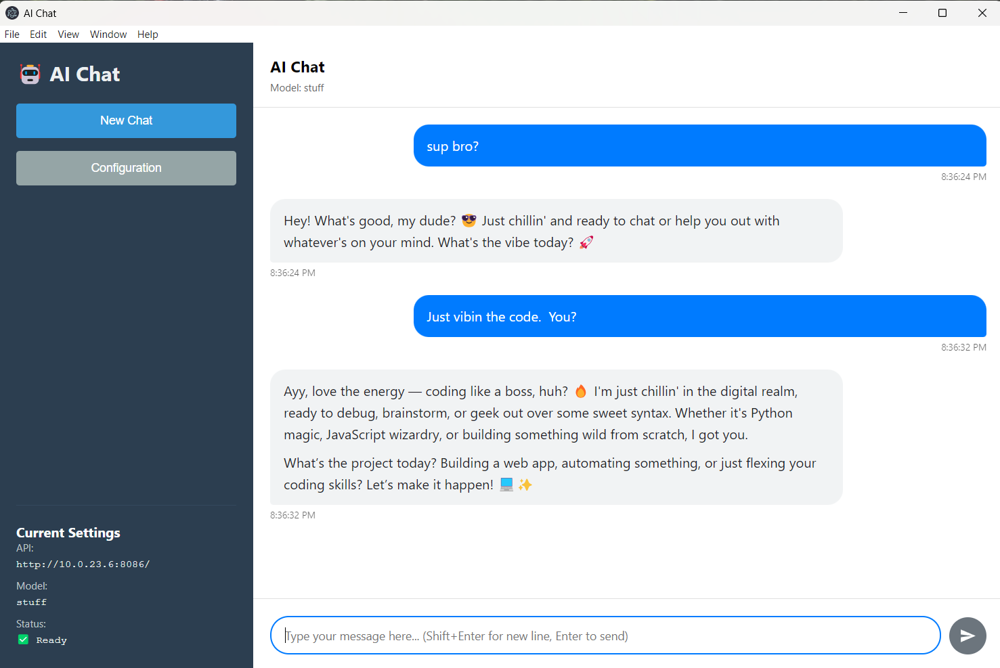
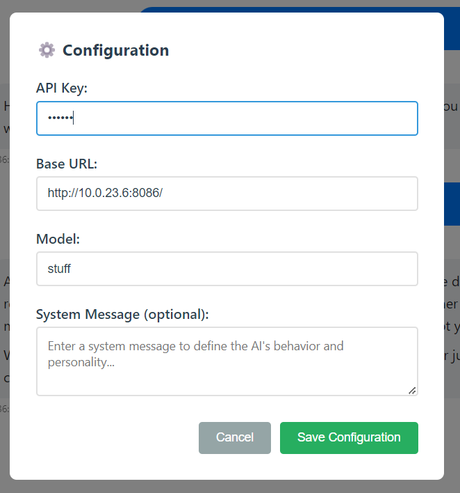

# AI Chat Desktop Application


A cross-platform desktop chat application for interacting with AI models like Claude and GPT. Built with Electron for a native desktop experience.

## Features

- 💬 Chat with AI models (Claude, GPT, and compatible APIs)
- ⚡ Streaming responses for real-time interaction
- 🔧 Configurable API endpoints and model settings
- 📝 Markdown support with syntax highlighting
- 📋 Code block copying functionality
- 🌙 Light/dark theme support
- 🖥️ Native desktop experience (Windows, Mac, Linux)

## Screenshots


*Example chat interface with markdown rendering*


*API configuration modal*

## Installation

### Prerequisites
- Node.js v16+
- npm or yarn

### From Source
```bash
# Clone the repository
git clone https://github.com/patw/ai-chat.git
cd ai-chat

# Install dependencies
npm install

# Run in development mode
npm run dev

# Build for production
npm run build
```

### Download Pre-built Binaries
Check the [Releases](https://github.com/patw/ai-chat/releases) page for pre-built binaries.

## Configuration

1. Open the application
2. Click the "Configuration" button
3. Enter your:
   - API Key
   - Base URL (e.g., `https://api.anthropic.com`)
   - Model name (e.g., `claude-3-sonnet-20240229`)
4. Save configuration

## Supported APIs

- Anthropic Claude API
- OpenAI API (and compatible endpoints)
- Any API with OpenAI-compatible interface

## Icon Generation

The application uses platform-specific icons generated from `icon.png`. To regenerate the icons:

```bash
npx electron-icon-maker --input=icon.png --output=icons
```

This will create all required icon sizes and formats in the `icons` directory for Windows, Mac, and Linux.

## Development

```bash
# Run in development mode with hot reload
npm run dev

# Package the application
npm run build

# Create distributable packages
npm run dist
```

## Contributing

Contributions are welcome! Please open an issue or submit a pull request.

## License

MIT © [Pat Wendorf](https://github.com/patw)
